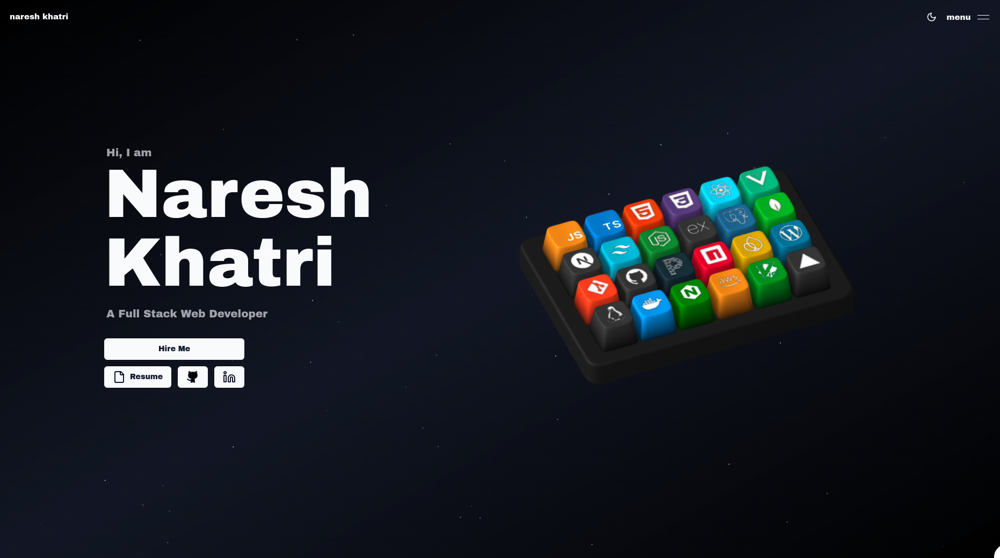

# Ade Rainhard Pasaribu Portfolio

Personal portfolio website for Ade Rainhard Pasaribu, also known as Ashlxy. The site presents my profile as a full-stack web developer with interactive visuals, project showcases, skills, blog content, and direct resume access.



## Live Preview

- Repository: [github.com/Ashlxxy/Portfolio-Web](https://github.com/Ashlxxy/Portfolio-Web)
- Resume: [CV_Ade_Rainhard_Pasaribu.pdf](public/assets/resume/CV_Ade_Rainhard_Pasaribu.pdf)

## Features

- Interactive 3D portfolio hero and skill keyboard
- Responsive dark themed interface
- Project showcase with screenshots
- Blog page with MDX content
- Contact section with mail draft support
- Resume button linked to the PDF CV in this repository
- Static export deployment for Cloudflare Workers Assets

## Tech Stack

| Area | Tools |
| --- | --- |
| Framework | Next.js, React, TypeScript |
| Styling | Tailwind CSS, shadcn/ui, SCSS |
| Animation | GSAP, Motion, Lenis |
| 3D | Spline, Three.js |
| Content | MDX |
| Deployment | Cloudflare Workers Assets, Wrangler |

## Getting Started

Install dependencies:

```bash
pnpm install
```

Run the development server:

```bash
pnpm dev
```

Build for production:

```bash
pnpm run build
```

Preview/deploy with Cloudflare:

```bash
pnpm run preview
pnpm run deploy
```

## Project Structure

| Path | Purpose |
| --- | --- |
| `src/app` | Next.js app routes and global styles |
| `src/components` | UI, layout, sections, animations, and interactive components |
| `src/data` | Personal config, projects, skills, and experience |
| `src/content` | Blog content |
| `public/assets` | Images, Spline files, audio, screenshots, and resume PDF |
| `wrangler.jsonc` | Cloudflare deployment configuration |

## Resume

The Resume button on the homepage opens:

```text
public/assets/resume/CV_Ade_Rainhard_Pasaribu.pdf
```

To update the resume later, replace that PDF file with a new version using the same filename.

## Contact

- Email: [aderainhardp@gmail.com](mailto:aderainhardp@gmail.com)
- GitHub: [Ashlxxy](https://github.com/Ashlxxy)
- LinkedIn: [Ade Rainhard Pasaribu](https://www.linkedin.com/in/ade-rainhard-pasaribu-42426432a)
- Instagram: [aderainhard](https://www.instagram.com/aderainhard)
